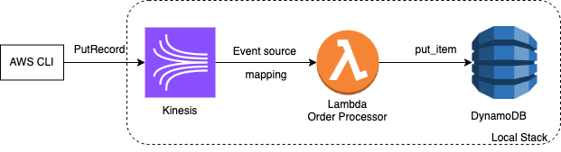

# Kinesis Lambda DynamoDB Localstack Example
## Architecture


## Setup
```bash
docker-compose -f ../docker-compose.yml up -d # setup stack
terraform init
terraform plan
terraform apply -auto-approve
```

## Test
```bash
aws --endpoint-url http://localhost:4566 --region us-east-1 dynamodb list-tables
# should show { "TableNames": [ "orders"]}

# ref: https://docs.aws.amazon.com/cli/latest/reference/kinesis/put-record.html
aws --endpoint-url http://localhost:4566 --region us-east-1 kinesis put-record --stream-name orders_stream --partition-key 123 --data $(echo -n "apple" | base64)
# should show something like
# {
#    "ShardId": "shardId-000000000000",
#     "SequenceNumber": "49659231208127431426808290990132035853766296146886524930",
#     "EncryptionType": "NONE"
# }

aws --endpoint-url http://localhost:4566 --region us-east-1 dynamodb scan --table-name orders
# should show
# {
#     "Items": [
#         {
#             "EventID": {
#                 "S": "shardId-000000000000:49659231208127431426808290990132035853766296146886524930"
#             },
#             "Data": {
#                 "S": "apple"
#             },
#             "OrderID": {
#                 "S": "789830c0-dcb6-4908-aa8a-8602069d6b8c"
#             },
#             "Timestamp": {
#                 "S": "2025-01-02T22:03:47"
#             }
#         }
#     ],
#     "Count": 1,
#     "ScannedCount": 1,
#     "ConsumedCapacity": null
# } 
```